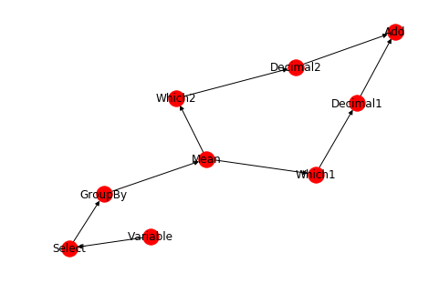

## 创建一个图

```python
import networkx as nx
G = nx.Graph()
```

## 节点

```python
一次添加一个节点
G.add_node(1)

添加一个节点列表
G.add_nodes_from([2, 3])
```

## 边

```python
可以通过一次添加一条边来增长
G.add_edge(1, 2)
e = (2, 3)
G.add_edge(*e)  # unpack edge tuple*

也可以通过添加边列表
G.add_edges_from([(1, 2), (1, 3)])
```

## 删除图中所有节点和边

```python
G.clear()
```

## 我们添加新的节点/边，并且NetworkX会自动的忽略任何已经存在的节点。

```python
G.add_edges_from([(1, 2), (1, 3)])
G.add_node(1)
G.add_edge(1, 2)
G.add_node("spam")        # adds node "spam"
G.add_nodes_from("spam")  # adds 4 nodes: 's', 'p', 'a', 'm'
G.add_edge(3, 'm')
```

## 在这个阶段，图形`G`由8个节点和3个边组成，如下所示：

```python
>>> G.number_of_nodes()
8
>>> G.number_of_edges()
3
```

我们可以检查节点和边。四个基本图形属性：`G.nodes`，`G.edges`，`G.adj`和`G.degree`。这些是节点，边，邻居（邻接点）和图中节点的程度集的视图。

```python
>>> list(G.nodes)
['a', 1, 2, 3, 'spam', 'm', 'p', 's']
>>> list(G.edges)
[(1, 2), (1, 3), (3, 'm')]
>>> list(G.adj[1])  # or list(G.neighbors(1))
[2, 3]
>>> G.degree[1]  # the number of edges incident to 1
2
```

可以以类似于添加的方式从图中移除节点和边。使用方法 [`Graph.remove_node()`](https://networkx.github.io/documentation/stable/reference/classes/generated/networkx.Graph.remove_node.html#networkx.Graph.remove_node)，[`Graph.remove_nodes_from()`](https://networkx.github.io/documentation/stable/reference/classes/generated/networkx.Graph.remove_nodes_from.html#networkx.Graph.remove_nodes_from)， [`Graph.remove_edge()`](https://networkx.github.io/documentation/stable/reference/classes/generated/networkx.Graph.remove_edge.html#networkx.Graph.remove_edge) 和 [`Graph.remove_edges_from()`](https://networkx.github.io/documentation/stable/reference/classes/generated/networkx.Graph.remove_edges_from.html#networkx.Graph.remove_edges_from)，如

 

```python
>>> G.remove_node(2)
>>> G.remove_nodes_from("spam")
>>> list(G.nodes)
[1, 3, 'spam']
>>> G.remove_edge(1, 3)
```

 

通过实例化其中一个图形类来创建图形结构时，可以使用多种格式指定数据

```python
>>> G.add_edge(1, 2)
>>> H = nx.DiGraph(G)   # create a DiGraph using the connections from G
>>> list(H.edges())
[(1, 2), (2, 1)]
>>> edgelist = [(0, 1), (1, 2), (2, 3)]
>>> H = nx.Graph(edgelist)
```

## 访问边和节点邻居

除了视图之外[`Graph.edges()`](https://networkx.github.io/documentation/stable/reference/classes/generated/networkx.Graph.edges.html#networkx.Graph.edges)，[`Graph.adj()`](https://networkx.github.io/documentation/stable/reference/classes/generated/networkx.Graph.adj.html#networkx.Graph.adj)还可以使用下标符号来访问边和邻居。

```python
>>> G[1]  # same as G.adj[1]
AtlasView({2: {}})
>>> G[1][2]
{}
>>> G.edges[1, 2]
{}
```

如果边已经存在，可以使用下标符号来获取/设置边的属性。

```python
>>> G.add_edge(1, 3)
>>> G[1][3]['color'] = "blue"
>>> G.edges[1, 2]['color'] = "red"
```

所有（节点，邻接节点）的快速查询都是使用 `G.adjacency()`或`G.adj.items()完成的`。请注意，对于无向图，邻接迭代会将每个边看两次。

```python
>>> FG = nx.Graph()
>>> FG.add_weighted_edges_from([(1, 2, 0.125), (1, 3, 0.75), (2, 4, 1.2), (3, 4, 0.375)])
>>> for n, nbrs in FG.adj.items():
...    for nbr, eattr in nbrs.items():
...        wt = eattr['weight']
...        if wt < 0.5: print('(%d, %d, %.3f)' % (n, nbr, wt))
(1, 2, 0.125)
(2, 1, 0.125)
(3, 4, 0.375)
(4, 3, 0.375)
```

通过边属性可以方便地访问所有的边。

```python
>>> for (u, v, wt) in FG.edges.data('weight'):
...     if wt < 0.5: print('(%d, %d, %.3f)' % (u, v, wt))
(1, 2, 0.125)
(3, 4, 0.375)
```

## 将属性添加到图形，节点和边

属性（如权重，标签，颜色或任何您喜欢的Python对象）可以附加到图形，节点或边上。

每个图形，节点和边都可以在关联的属性字典中保存键/值属性对（键必须是可散列的）。默认情况下，这些都是空的，但属性可以使用添加或更改`add_edge`，`add_node`或命名的属性字典的直接操作`G.graph`，`G.nodes`和 `G.edges`一个图`G。`

## 图形属性

创建新图形时分配图形属性

```python
>>> G = nx.Graph(day="Friday")
>>> G.graph
{'day': 'Friday'}
```

或者也可以修改属性

```python
>>> G.graph['day'] = "Monday"
>>> G.graph
{'day': 'Monday'}
```

## 节点属性

添加节点属性使用`add_node()`，`add_nodes_from()`或`G.nodes`

```python
>>> G.add_node(1, time='5pm')
>>> G.add_nodes_from([3], time='2pm')
>>> G.nodes[1]
{'time': '5pm'}
>>> G.nodes[1]['room'] = 714
>>> G.nodes.data()
NodeDataView({1: {'room': 714, 'time': '5pm'}, 3: {'time': '2pm'}})
```

## 边属性

添加/更改边使用的属性`add_edge()`，`add_edges_from()`或标符号。

```python
>>> G.add_edge(1, 2, weight=4.7 )
>>> G.add_edges_from([(3, 4), (4, 5)], color='red')
>>> G.add_edges_from([(1, 2, {'color': 'blue'}), (2, 3, {'weight': 8})])
>>> G[1][2]['weight'] = 4.7
>>> G.edges[3, 4]['weight'] = 4.2
```

## 有向图:DiGraph()

DiGraph类提供特定于有向边的附加属性，例如`DiGraph.out_edges（）`，`DiGraph.in_degree（）`，`DiGraph.predecessors（）`，`DiGraph.successors（）`等。为了使算法能够轻松地处理这两个类， `neighbor（）`的功能等同于`successors（）`，而`degree`会报告`in_degree`和`out_degree`的总和，即使有时可能会感觉不一致

```python
dg = nx.DiGraph()
nodes1 = [
    ('Variable', {'name': 'avariable', 'table': 'tablename'}),
    ('Select', {'conditions': {'pro_code': 44}}),
    ('GroupBy', {'varname': 'gender'}),
    ('Mean', {}),
    ('Which1', {'level': 1}),
    ('Decimal1', {'place': 1}),
]

nodes2 = [
    ('Which1', {'level': 2}),
    ('Decimal2', {'place': 1}),
]

nodes3 = [
    ('Add', {})
]

dg.add_nodes_from(nodes1)
dg.add_nodes_from(nodes2)
dg.add_nodes_from(nodes3)
dg.add_edges_from([
    ('Variable', 'Select'),
    ('Select', 'GroupBy'),
    ('GroupBy', 'Mean'),
    ('Mean', 'Which1'),
    ('Mean', 'Which2'),
    ('Which1', 'Decimal1'),
    ('Which2', 'Decimal2'),
    ('Decimal1', 'Add'),
    ('Decimal2', 'Add'),
])

nx.draw(dg, with_labels=True)
```

