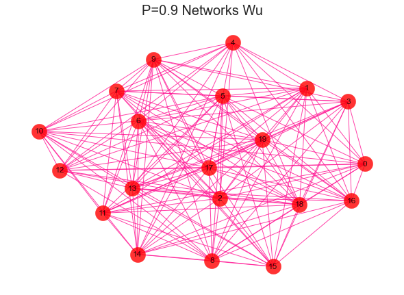

## Louvain

## 1、社区发现概述

### 1.1、社区

在最常见的社交网络中，每个用户相当一个点，用户之间的互相关注、点赞、私信等形成了边，用户以及相互作用关系构成了一个大的关系网络。在这样的网络中，有的用户之间的连接较为紧密，有的用户之间的连接关系较为稀疏。其中连接较为紧密的部分可以被看成一个社区，其内部的节点之间有**较为紧密**的连接，而在两个社区间则相对连接**较为稀疏，**整个整体的结构被称为社团结构，如下图，红色的黑色的点集呈现出社区的结构。


用红色的点和黑色的点对其进行标注，整个网络被划分成了两个部分，其中，这两个部分的内部连接较为紧密，而这两个社区之间的连接则较为稀疏。如何去划分上述的社区便称为社区划分的问题。

### 1.2、社区发现的目标和意图

就是在图中找到一些“**潜在的有特定关系的组织**”，也就是**社区(community)**。直观地说，社区发现（community detection）的一般目标是要探测网络中较为紧密的【块cluster】或是【社团community】。目的和效果，特别是在风控中，很多有目的的团伙，聚集在一起，有明显的社群关系。哪个块是高风险，哪个块是高价值，非常值得挖掘。

### 1.3、节点间存在连接的抽象本质 - 逻辑拓朴结构

**社区的节点间是网络拓朴结构，即节点间是存在拓朴连接结构的，我们不能将其和欧式空间或者P空间中的点向量集合空间混为一谈**。

#### 1.3.1、欧式空间

不同的节点向量存在于不同的空间位置中，向量夹角近的点向量彼此距离近，而向量夹角远的向量彼此距离远。但是即使是欧式距离很近的向量点，也不一定就代表这它们之间存在拓朴连接关系，只能说在一定的度量下（例如欧式距离度量），这两个节点很相近。但是在社区结构中，节点之间没有什么空间位置的概念。

#### 1.3.2、逻辑拓朴

相对的，节点间存在的是一种**逻辑拓朴结构**，即存在一种**共有关系**。存在共有关系的节点在逻辑上会聚集为一个社区，而社区之前不存在或者存在很弱的共有关系，则呈现分离的逻辑拓朴结构。一定要注意不要用空间结构的概念来试图理解社区结构，不然会陷入理解的困境，并且会限制想象力，社区中的节点只是因为**逻辑上的共有关系而聚集在一起而已**，彼此之间的位置也没有实际意义，而社区族群之间的分离也是表达一种逻辑上的弱共有关系。

#### 1.3.3、实际的例子

- **假如节点代表消费者**：节点间的连接代表了它们共同购买了一批书籍，权重代表共同购买的书籍数，链接越紧密，代表社群的爱好越相近。

- **假如节点代表消费者**：节点间的连接代表了它们共同领取一批优惠券，权重代表共同领取的优惠券的数量，该社群可能是一个羊毛党社群。

- **假如节点代表商家**：节点间的连接代表了它们共同商品标题，权重代表共同标题商品的数量，该社群可能是一个店群商家，不断换点进行欺诈。

共同的地点、共同的设备、共同的轨迹、共同的时间、共同的证件等等，都可以作为这种逻辑关系的存在，作为一个网络，进行社区挖掘，达到业务目的。

### 1.4、使用社区发现算法前提

- 聚集规律：需要先确定要解决的业务场景中，存在明显的聚集规律，节点（可以是抽象的）之间形成一定的族群结构，而不是呈现无规律的随机分散。

- 聚集的结构是“有意义的”：这里所谓的有意义是指这种聚集本身可以翻译为一定的上层业务场景的表现。

但是很多时候，业务场景中的数据集之间的共有关系并不是表现的很明显，即节点之间互相都或多或少存在一些共有关系，这样直接进行社区发现效果肯定是不好的。就没必要进行社区发现挖掘。

所以一个很重要点是，**在进行社区发现之前，一定要进行数据降噪**。理想情况下，降噪后得到的数据集已经是社区完全内聚，社区间完全零连接，这样louvain只要一轮运行就直接得到结果。当然实际场景中不可能有这么好的情况，数据源质量，专家经验的丰富程度等等都会影响降噪的效果，一般情况下，降噪只要能cutoff 90%以上的噪音，louvain就基本能通过几轮的迭代完成整体的社区发现过程。

### 1.5、社区划分的直观思路

#### 1.5.1、成团条件

一种很直观的想法是，同一团内的节点连接更紧密，即具有更大的密度。

#### 1.5.2、密度描述指标

Louvian 定义了一个数值上的概念（本质上就是一个目标函数），有了这个目标函数，就可以引出接下来要讨论的**基于模块度**的方法。

#### 1.5.3、场景

从这个算法的思想上来看，倾向于认为社区发现算法比较适合发现一种"抽象泛共现模式"，这种共现是一种泛化的共现，它可以是任何形式的共现，

**例如**

- 两个用户拥有共同的介质

- 两个用户昵称采用共同的起名方式，比如名字加数字，同样的前缀，或者都是四字成语等

- 用户拥有相同的行为，比如做过同样的操作，

- 用户拥有共同的控制人等

- 两个用户发布的内容拥有相似的词频数据

- 两个用户拥有相同的运动轨迹

... ...

社区发现的落地效果，很大程度上，取决于对业务拓扑逻辑的抽象水平，以及数据降噪的结果，而不取决于发现的算法。并且不同场景，采用的社区发现算法不一样。在大数据场景下，没有上帝全局视角，并且很多常识在规模面前也不管用，甚至引起认知谬误，因此社区发现算法的结果不可能完美，必须结合业务实际情况进行调节和控制，再应用。

## **2、模块度**

在各类网络中会存在一些紧密连接的区域，这些区域（节点集）通常有自己的属性，称为**社群或者社团（Community）**，社团内部连接紧密，而社团外部的连接则相对稀疏，即“内紧外松”


“社群检测”等同于“给节点分组”，**模块度（Modularity）**是一种常用的衡量节点**分组质量**的标准，模块度越高说明所检测到的社团越符合“内紧外松”的特征，分组质量越好。

基于模块度的概念，网络科学奠基人之一Mark Newman于2004年提出了一种经典的社团检测方法—**模块度最大值法（Modularity maximization）**。它通过考虑网络中所有可能的节点分组，找到使得模块度最大的分组方式。基于模块度的社团检测算法至今仍被广泛使用。


要计算一个网络的模块度，需要构造一个具有相同节点度分布的随机网络作为参照。通俗地来说，模块度的物理含义是：在社团内，实际的边数与随机情况下的边数的差距。如果差距比较大，说明社团内部密集程度显著高于随机情况，社团划分的质量较好。模块度取值范围在[-0.5,1]之间。如果节点组中的连边数量超过了随机分配时所得到的期望连边数量，模块度为正数。没有超过，则为负数。


## **3、模块度最大化算法**

模板度最大值法是使用最为广泛的社团检测方法之一，该方法的目标是从所有可能的分组中找到使得模块度最大的分组，由于穷举所有可能的分组十分困难，所以实际的算法都采用近似优化方法。例如，Mark Newman 提出了模块度最大化的贪婪算法**Fast NewMan (FN)**。贪婪算法的原理是找出每个局部最优值，最终将局部最优值整合成整体的近似最优值。


模块度是评估一个社区网络划分好坏的度量方法，它的物理含义是社区内节点的连边数与随机情况下的边数之差，它的取值范围是[−1/2,1)，其定义如下：


其中， *Aij* 表示节点*i*和节点*j*之间边的权重和，网络不是带权图时，所有边的权重可以看做是1；*ki*表示所有与节点*i*相连的边的权重之和（度数）；*δ(ci,cj)*表示节点 *i* 和节点 *j* 是否属于同一社区，如果属于则*δ(ci,cj)=1*，否则*δ(ci,cj)=0*；


表示所有边的权重之和（边的数目）；公式中


节点j连接到任意一个节点的概率是


，现在节点*i*有*ki*的度数，因此在随机情况下节点*i*与*j*的边为


。模块度的公式定义可以作如下简化：


其中*Σin*表示社区*c*内的边的权重之和，*Σtot*表示与社区*c*内的节点相连的边的权重之和。上面的公式还可以进一步简化成:


这样模块度也可以理解是社区内部边的权重减去所有与社区节点相连的边的权重和，对无向图更好理解，即社区内部边的度数减去社区内节点的总度数。基于模块度的社区发现算法，都是以最大化模块度*Q*为目标。

### 3.1、算法流程

Louvain算法思想：

1. 将图中的每个节点看成一个独立的社区，社区的数目与节点个数相同；
2. 对每个节点i，依次尝试把节点i分配到其每个邻居节点所在的社区，计算分配前与分配后的模块度变化*Δ*，并记录*Δ*最大的那个邻居节点，如果 Δ >0，则把节点i分配*Δ*最大的那个邻居节点所在的社区，否则保持不变；
3. 重复2，直到所有节点的所属社区不再变化；
4. 对图进行压缩，将所有在同一个社区的节点压缩成一个新节点，社区内节点之间的边的权重转化为新节点的环的权重，社区间的边权重转化为新节点间的边权重；
5. 重复1，直到整个图的模块度不再发生变化。

从流程来看，该算法能够产生层次性的社区结构，其中计算耗时较多的是最底一层的社区划分，节点按社区压缩后，将大大缩小边和节点数目，并且计算节点i分配到其邻居j的时模块度的变化只与节点i、j的社区有关，与其他社区无关，因此计算很快。在论文中，把节点i分配到邻居节点j所在的社区c时模块度变化为：


*Σin*是社区*c*内节点与节点*i*的边权重之和, 是对应边权重加起来再乘以2，这点在实现时很容易犯错。

*Δ*分了两部分：

- 前面部分表示把节点*i*加入到社区*c*后的模块度，

- 后一部分是节点*i*作为一个独立社区和社区*c*的模块度

在实现的时候模块度变化还可以简化，把上面的公式展开，很多项就抵消了，化简之和：


模板度最大值法的基本原理：

1. 初始时将网络中的每个节点都看成独立的小社团。
2. 考虑所有相连社团两两合并的情况，计算每种合并带来的模块度的增量。
3. 基于贪婪原则，选取使模块度增长最大的两个社团，将它们合并成一个社团。
4. 如此循环迭代。随着迭代的进行，模块度不断变化，其最大值时对应最优社团划分。


使用Python的网络科学工具包NetworkX , 可以轻松调用Louvain算法，实现社团检测。

官网地址：[https://networkx.github.io](https://link.zhihu.com/?target=https%3A//networkx.github.io)

### 3.2、随机图

一个好的社区一定是内部的连接要比随机连接情况下的连接更紧密。随机需要一个零模型(图模型)，选择配置模型(configuration model)，为了保证与原图有相同的度分布，这里允许有重边的多重图。


## **四、Louvain 算法**

louvain 算是目前市面上提到的和使用过的最常用的社区发现算法之一了，除此之外就是 infomap，这两种。原始论文为：《Fast unfolding of communities in large networks》。所以又被称为Fast unfolding算法。


模块度（Modularity）用来衡量一个社区的划分是否优良。一个好的划分结果其表现形式是：在社区内部的节点相似度较高，而在社区外部节点的相似度较低。模块度的定义由于当时研究的图类型的不同而一直发生变化，

**模块度**是评估一个社区网络划分好坏的度量方法，它的物理含义是社区内节点的连边数与随机情况下的边数之差，它的取值范围是 [−1/2,1)，其定义如下：


结论：模块度越大，挖掘的社区内部连接越紧密，效果越好。


**对无权图：**模块度社区内部边的度数减去社区内节点的总度数。**对于权重图：**模块度也可以理解是社区内部边的权重减去所有与社区节点相连的边的权重和。既然，模块度是评价社区结构好坏的指标。那么，自然可以通过最大化模块度来识别社区。这就是下面算法的思想。

## 1、不同密度社区对比

这个公式的含义一定要理解清楚才能体会到 louvain 背后的真谛，我们来直观的看看，不同紧密程度的社区长什么样子。

```python
#导入建网络模型包，导入科学绘图包
import networkx as nx
import matplotlib.pyplot as plt 
'''
随机生成网络 用erdos_renyi_graph(n,p)方法生成一个含有n个节点、
以概率p连接的ER随机图，在本程序中以概率0.8连接20个节点中的每一对节点，完成图形。
'''

for i in range(1,11):
    rate = i/10   
    print(rate) 
    G  = nx.erdos_renyi_graph(20,rate)
    nx.draw(G,
            with_labels=True,
            pos=nx.kamada_kawai_layout(G),
            #width=edgewidth,
            node_size=500,
            alpha=0.8,
            node_color="r",
            edge_color="DeepPink"
            )
    text = 'P={rate} Networks Wu'.format(rate=rate)
    plt.title(text, fontsize = 20)
    plt.show()
```





## 2、社区发现效果评估-模块化指数Q

光说思路是没有意义的，在数学上应该如何定义社区发现效果的好坏呢？结论就是**直接和随机模型比较就好啦！**你问我什么叫随机模型？简单来说就是图中节点和边数量不变，把节点之间连接关系随机打乱。那么根据这个思路，**如果这个图一点都不像随机图，那么说明这个图存在一定的社区结构！**用方程可以这样表示（看不懂没关系，往下翻就对了）：


**模块度**是评估一个社区网络划分好坏的度量方法，它的物理含义是**社区内节点**的**连边数**与随机情况下的边数之差，它的取值范围是 [−1/2,1)，其定义如下：


**Q的取值范围是[−1 , 1]，一般认为取值在0.3~0.7之间就认为有明显的社区结构出现了。这个公式的含义一定要理解清楚才能体会到 louvain 背后的真谛。**


可以简单理解为，固定节点数，给定图的连接有多少条边，用同样多的节点，随机生成的图，有多少个边，相减，得到的差越大，说明给定图越紧密。为了更好的理解这里举一个具体的例子：


## 3、社区发现算法-Louvain


在现实生活中，存在着各种各样的社会网络，比如人际关系网、交通网、金融网等，对这些网络进行社区发现具有极大的意义。例如在社交网络中社区发现、基于好友关系为用户推荐商品或内容、社交网络中人物影响力的计算、信息在社交网络上的传播模型、虚假信息和机器人账号的识别、基于社交网络信息对股市、大选以及金融行业中的反欺诈预测等。**时下，社交网络爆发，图数据库应用火爆，**其中，**Louvain（鲁汶）算法在图数据分析领域的众多算法中是比较复杂的**，同时别具意义**。**


好家伙，到这里才算是引出了本文的正题。截至到本文发布，Louvain算法还是社区发现算法里的靓仔，与infomap算法共同成为调包侠们的最爱。

Louvain算法的思路也很简单，一句话：**不择手段把图的模块化指数Q搞大。**事实上Louvain算法也就是个**贪心算法**，主要分为以下几步：


**第一步**，将图中每个节点都看作一个社区（没错就是一个节点的社区），尝试让某个节点加入邻居的社区，**计算图的模块化指数增量ΔQ，并最终选择一个ΔQ最大的邻居社区加入**，比如下图我们从编号为0的节点开始，经过第一步后有如下过程：


有些同学可能会问，每次都要重新计算全局的ΔQ也太麻烦了叭，当然我们有更简单的办法啦，这个时候我们只需要计算这个局部ΔQ就可以惹，那么这个局部ΔQ就可以表示为：


- ∑in是社区C内部连接权重之和
- ∑tot是社区C所有连接权重的和，包括社区与外部的链接；
- ki,in是节点i和社区C之间连接权重之和；
- Ki是与节点i相关的所有连接权重之和。

仔细想想确实还挺有道理，但是我懒，调包就完事儿了（手动狗头）


**第二步**，在第一步的基础上，**把划分出来的社区当成一个超节点看待**，如下图所示：


这里需要注意两点：

- 超节点对应的社区内部存在边，需要把它们的权重求和，并作为超节点自环的权重
- 超节点之间的社区存在边，需要把它们的权重求和，并作为超节点之间的边权重


**第三步**，如果算法已经达到了目标（比如最大的ΔQ小于某个值）那么算法结束，否则将超节点视为普通节点，并回到第一步。这里展示第二轮循环的结果：


## 五、基本概念—权重度

Louvain（鲁汶）算法是基于模块度（modularity）计算的社区识别算法，是以最大化模块度为目标的一种对顶点进行聚类的迭代过程。该算法由比利时鲁汶大学的 Vincent D.Blondel 等人于 2008 年提出，因其能以较高的效率计算出令人满意的社区识别结果，而成为近年来最多被提及和使用的社区识别算法。主要用于社交网虚假账号识别、消费群体划分及商品推荐、银行卡伪冒和欺诈团伙识别、银行理财产品、保险产品推荐、企业集团及家族企业识别等领域。Louvain（鲁汶）算法的基本概念包括：1、权重度2、社区压缩3、模块度4、模块度增**权重度**是考虑了边上权重的度的计算。鲁汶算法在计算模块度时用到了节点权重度和社区权重度两个概念。

## 1、节点权重度

**节点权重度**是指与某个点有关（以该点为端点）的所有边的权重和，包括该点的邻边（连接至其它点）以及该点的自环边（连接至该点自身）。


图1：节点权重度如图1所示，红色节点有三条邻边和一条自环边，因此该点的权重度为**1 + 0.5 + 3 + 1.5 = 6**（注意：自环的权重只被计算1次）。


## 2、社区权重度

**社区权重度**是指一个社区内所有节点的权重度的和。


图2：社区权重度如图2所示:红色节点的权重度为 1 + 0.5 + 3 + 1.5 = 6绿色节点的权重度为 1 + 1.7 = 2.7蓝色节点的权重度为 0.5 + 0.3 + 2 = 2.8黄色节点的权重度为 3因此 1 号社区的权重度为 6 + 2.7 + 2.8 + 3 = 14.5


## 3、社区内部权重度

**社区内部权重度**是指在计算一个社区的权重度时，仅考虑两个端点均在该社区内的边；或者说，从该社区的权重度中去掉该社区和其它社区之间的边的权重，即为该社区的内部权重度。如上图所示，Ⅰ号社区和其它两个社区之间共有三条边，权重分别为 1.7、0.3 和 2，因此Ⅰ号社区的内部权重度为 14.5 - 1.7 - 0.3 - 2 = 10.5


注意，社区内部权重度并不是两个端点均在社区内的边的权重和，而是这些边当中的非自环边的权重和的二倍再加上自环边的权重和。原因是非自环边的两个端点会令该边被计算两次。换句话说，社区内部除了自环类型的边的权重只被计算一次，其它边会被计算两次——因为每个边会连接2个端点，按照社区内部权重度的定义，边的权重需要x2。用上一张图进行验证，Ⅰ号社区的内部权重度可以计算为 (1 + 0.5 + 3) * 2 + 1.5 = 10.5


## 4、全图权重度

**全图权重度**是指图中所有节点的权重度的和。如果将全图划分为多个社区，由于图中每个点属于并且仅属于一个社区，全图权重度也等于这些社区的权重度的和。


图3：全图权重度如图3所示，Ⅰ号社区的权重度为 14.5，Ⅱ号社区的权重度为 0.7 * 3 * 2 + 1.7 = 5.9，Ⅲ号社区的权重度为 1 * 6 * 2 + 0.3 + 2 = 14.3，全图的权重度为 14.5 + 5.9 + 14.3 = 34.7


如果将全图看成一个社区，那么全图权重度也可以理解为该社区的内部权重度。还用上图进行验证，全图权重度为 (1 + 0.5 + 3 + 1.7 + 0.7 * 3 + 0.3 + 2 + 1 * 6) * 2 + 1.5 = 34.7

以上两种计算方法的结果可以相互印证，并且应该是一致的。

## **六、基本概念—社区压缩**

时下，社交网络爆发，图数据库应用火爆，其中，Louvain（鲁汶）算法在图数据分析领域的众多算法中是比较复杂的，同时别具意义。在上节的“文库”中，我们详细解读了权重度，本节将具体对社区压缩进行科普。做好准备，干货来了！

## 1、什么是社区压缩？

**社区压缩**是将**每个社区内的所有节点**用**一个聚合点**来表示，该社区的内部权重度即为此聚合点的自环边的权重，每两个社区间的边的权重和即为相应两个聚合点之间的边的权重。


如动图所示，对I、II、III三个社区进行压缩，I号社区压缩后的自环边的权重为该社区的内部权重，即 10.5；II 号社区压缩后自环边的权重为0.7 * 3 * 2 = 4.2，III 号社区压缩后自环边的权重为1 * 6 * 2 = 12。同时，I 号与 II号社区之间的边压缩后权重为 1.7，与 III 号社区之间的边压缩后权重为0.3 + 2 = 2.3。


插播一段，看上图。注意呀，以I号社区为例，它的权重度等于10.5。除了自环边，其中红绿、红蓝和红黄的点边，都需要**分别计算2次**哦。


综上，经过倒推计算可知，压缩后的全图权重度为10.5 + 4.2 + 12 + (1.7 + 2.3) * 2 = 34.7，与压缩前相同。


压缩前和压缩后的结果，是相等的呀！


## 2、为什么要进行社区压缩？

在鲁汶算法中，使用了大量的社区压缩。那为什么要进行压缩呢？它的作用是什么呢？究其本质来看，进行社区压缩有两方面的好处：一是，让计算效率变高。进行社区压缩，在不改变局部权重度及全图权重度的前提下，通过最大限度减少图的点、边数量来提高后续（迭代）的计算速度；


二是，实现层级化的社区划分。社区内的点在压缩后将作为一个整体进行模块度优化的计算，不再拆分，从而实现了层级化（迭代化）的社区划分效果。

## 七、Louvain算法结果处理

细心的同学肯定发现了，经过Louvain算法计算后的社区，是一个多层次的结构，通常来说它会是这样的：


那么选取哪个层次的社区结构也是比较头疼的过程呢。这里我建议可以将**手肘法**作为辅助工具，当**模块化指数Q或社区数量随着迭代次数增加出现明显拐点**的时候，选取对应层次的社区结构就比较合理啦，比如下面这样的：


## **八、Louvain算法应用**

很多人在调用community.best_partiton()方法时，总是报错：AttributeError: ‘module’ object has no attribute ‘best_partition，一直使用失败，许多网络上代码直接调用**import community**， 就以为这个包叫community，实际上，这个包叫python-louvain。包的地址为：[https://github.com/taynaud/python-louvain](https://link.zhihu.com/?target=https%3A//github.com/taynaud/python-louvain)


\#安装的方法为：

如果遇到问题，可以按下面的方法进行安装

```text
‘’‘
不要单独安装networkx和community ，会导致Graph没有best_parition属性。
安装与networkx 2.x 版本对应的python-louvain(它内部包含了community)
‘’‘
pip install -U git+https://github.com/taynaud/python-louvain.git@networkx2


# 安装 networkx,理论上应该默认安装最新版版的 2.4
pip install networkx


# 调用并测试分群的结果                                                                                       
from community import community_louvain
import matplotlib.cm as cm
import matplotlib.pyplot as plt
import networkx as nx

# load the karate club graph
G = nx.karate_club_graph()

# 对图数据进行社群划分
partition = community_louvain.best_partition(G)


# 查看分组情况
print(partition)
{0: 0, 1: 0, 2: 0, 3: 0, 4: 1, 5: 1, 6: 1, 7: 0, 8: 3, 9: 3, 10: 1, 
 11: 0, 12: 0, 13: 0, 14: 3, 15: 3, 16: 1, 17: 0, 18: 3, 19: 0, 
 20: 3, 21: 0, 22: 3, 23: 2, 24: 2, 25: 2, 26: 3, 27: 2, 28: 2, 
 29: 3, 30: 3, 31: 2, 32: 3, 33: 3
}

#在实际应用的时候，我们一般转换成DataFrame
import pandas as pd
pd.DataFrame({'Id':partition.keys(),'Group':partition.values()})
    Id  Group
0    0      0
1    1      0
2    2      0
3    3      0
4    4      1
5    5      1
6    6      1
7    7      0
8    8      3
9    9      3


# draw the graph
pos = nx.spring_layout(G)

# color the nodes according to their partition
cmap = cm.get_cmap('viridis', max(partition.values()) + 1)
nx.draw_networkx_nodes(G, 
                       pos, 
                       partition.keys(), 
                       node_size=40,
                       cmap=cmap, 
                       node_color=list(partition.values())
                      )
nx.draw_networkx_edges(G, pos, alpha=0.5)
plt.show()
```


